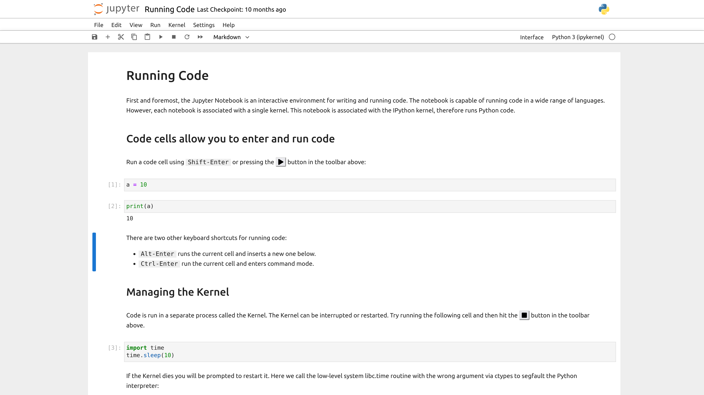
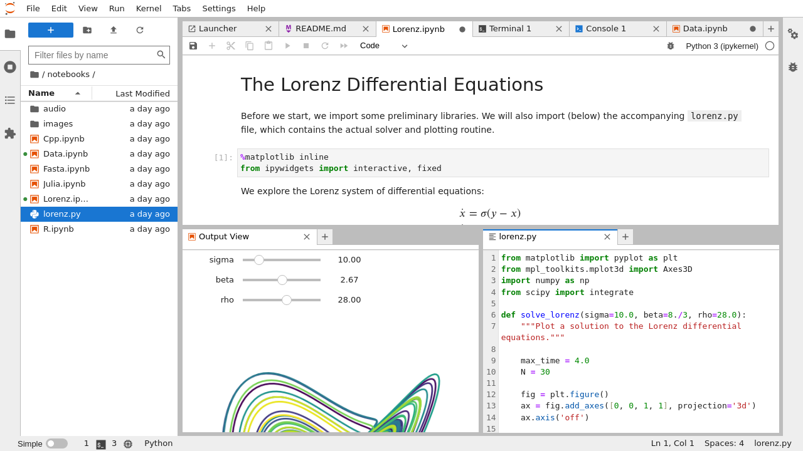

# Créer des sites web Jupyter interactifs avec JupyterLite

## AlpOSS 2024

### Jérémy Tuloup

---

# About

## Jérémy Tuloup

- Directeur Technique à QuantStack
- Jupyter Distinguished Contributor
- Jupyter Frontends SSC (Steering Software Council) representative
- Contributeur à de nombreux projets Jupyter
- Créateur de JupyterLite

---

# Historique rapide de Jupyter

---

# IPython dans le terminal

---

# REPL: Read Eval Print Loop

---

# Pourquoi les Jupyter Notebook sont populaires ?

- Le workflow REPL
- Avec en plus:
  - **narration**
  - **mémoire**
  - **reproductibilité**
  - **communication**

---

# IPython Notebook

---

# Jupyter Notebook

---

# JupyterLab

---

# L'écosystème Jupyter est très vaste

- Navigating the Jupyter Landscape
  - JupyterCon 2023 (Paris)
  - Jeremy Tuloup, Johan Mabille 
  - https://www.youtube.com/watch?v=uWJ0-OPKTxI

---

---

# JupyterLite

- Tout tourne dans le navigateur web via WebAssembly
- Se base sur la stack Jupyter existante:
  - Les noyaux Pyodide et Xeus exécutent le code dans le navigateur
  - Interfaces web JupyterLab et Jupyter Notebook
  - Voici pour faire des applications web et dashboards

---

---

---

# Cas d'usage

---

---

---

# Un site Jupyter accessible en quelques secondes

---

# Education

---

# Ressources

- Documentation Jupyter: https://docs.jupyter.org
- Cette présentation: https://github.com/jtpio/alposs-2024

---

# Merci !
