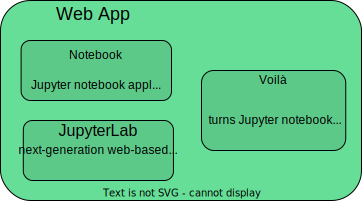
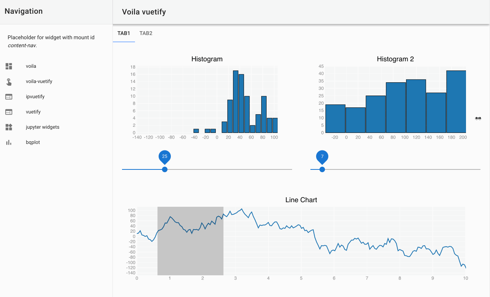
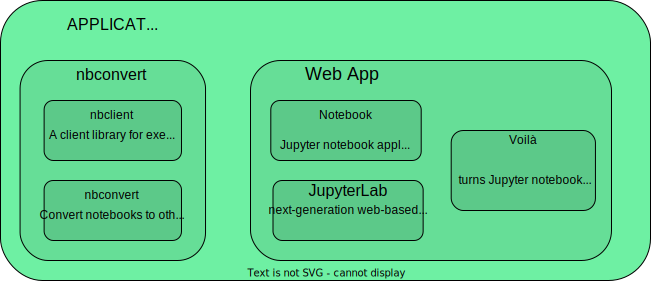
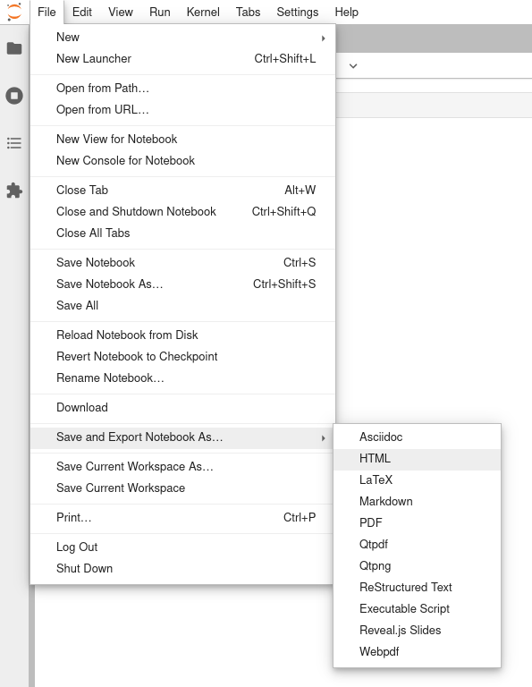
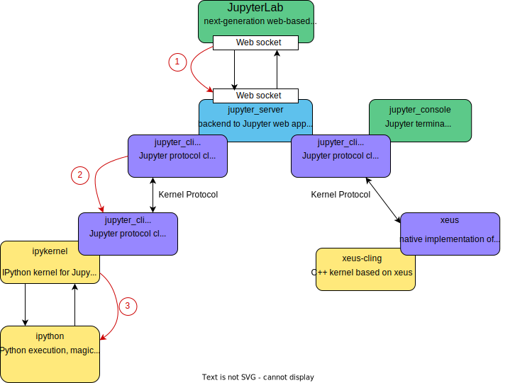

# Creer des sites Jupyter interactifs avec JupyterLite

## AlpOSS 2024

---

# About

## Jérémy Tuloup

- Technical Director at QuantStack
- Jupyter Distinguished Contributor
- Contributes to JupyterLab, Jupyter Notebook, Voilà
- Author of JupyterLite

---

---

# The Jupyter Interfaces

---

---

# JupyterLab

- Next-gen UI for Project Jupyter
- Allows to work with multiple notebooks, consoles, text editors, terminals, etc...
- Rich ecosystem of extensions
- Allows for custom lab-based applications
- Start with `jupyter lab`

---

# Jupyter Notebook

- What users often call "Jupyter"
- The frontend is a web application
- Notebook 7 is built with JupyterLab components
- Start with `jupyter notebook`

---

# Voilà

- Turn notebooks into standalone web applications
- Can be customized with templates and themes
- Start with `voila my_notebook.ipynb`

---

---

# nbconvert

- Convert notebooks to other formats
- Start with `jupyter nbconvert my_notebook.ipynb`
- Can also be used from the notebook UI

---

# The Jupyter Backends

---

---

# Jupyter Server

- Backend to Jupyter Web applications (not the consoles):
    - core services
    - APIs
    - REST endpoints
- Client of kernels
- Responsible for launching and keeping kernels alive
- Use the same protocol for Web apps and kernels

---

# Servers

- Jupyter Server: historical, mono user, based on tornado
- Jupyverse: alternative implementation based on asyncio
- JupyterHub: multi-user server using Jupyter Server

---

---

# Kernel protocol

- Documentation at https://jupyter-client.readthedocs.io/en/stable/messaging.html
- Agnostic to the language
- `jupyter_client` is the reference implementation in Python
- `xeus` is the reference implementation in C++
- Implementations rely on ZeroMQ

---

---

# Kernels

- ipykernel, reference implementation of python kernel
- kernel wrapper approach (kernels based on ipykernel)
- standalone kernels (IJulia, IRKernel)
- xeus-based kernels (xeus-cling, xeus-python, xeus-lua, etc...)

---

# The Jupyter Widgets

---

---

# Widgets

- ipywidgets / xwidgets: basic interactive widgets (sliders, buttons, checkboxes...)
- ipyleaflet / xleaflet: interactive maps based on leaflet
- bqplot / xplot: plotting libraries implementing the grammar of graphics
- many others ....

---

# JupyterLite

- WebAssembly powered Jupyter running in the browser
- Stands on the shoulder of giants:
  - Xeus kernels running in the browser
  - JupyterLab and Jupyter Notebook
  - Voici to turn notebooks into static web applications
  - Support for Jupyter Widgets and visualization libraries
- No real `jupyter-server`, `jupyter-client`, `nbconvert`

---

---

---

# Resources

- Jupyter Documentation: https://docs.jupyter.org
- This presentation: https://github.com/JohanMabille/navigating-jupyter-landscape

---

# Thanks!

---

